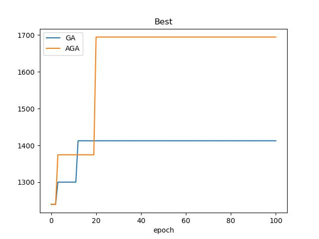

## Improved Genetic Algorithm改进遗传算法

### 所需环境
matplotlib==3.7.1

### 代码解释
#### 一.data.py
生成n个城市的x，y坐标

#### 二.GA.py
用传统遗传算法解决旅行商问题

#### 三.AGA.py
用改进的自适应遗传算法解决旅行商问题

#### 四.draw.py
将传统遗传算法和自适应遗传算法解决旅行商问题过程中Best值的变化曲线画在同一张图中，对比两种算法的性能

### 使用步骤
运行draw.py，获得对比图image.jpg 。随机种子设为0、迭代100次后结果如下

